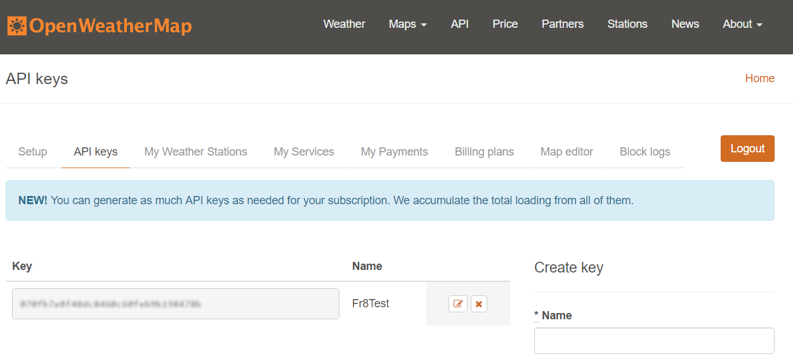
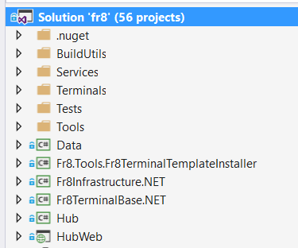
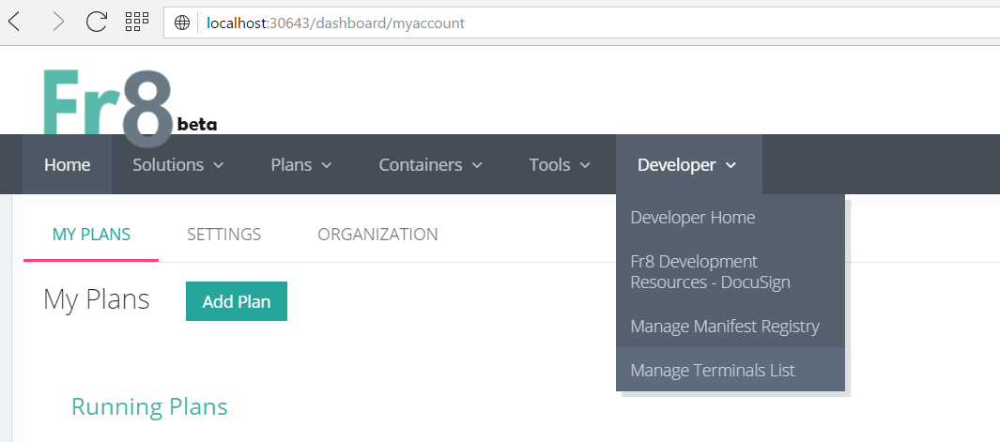
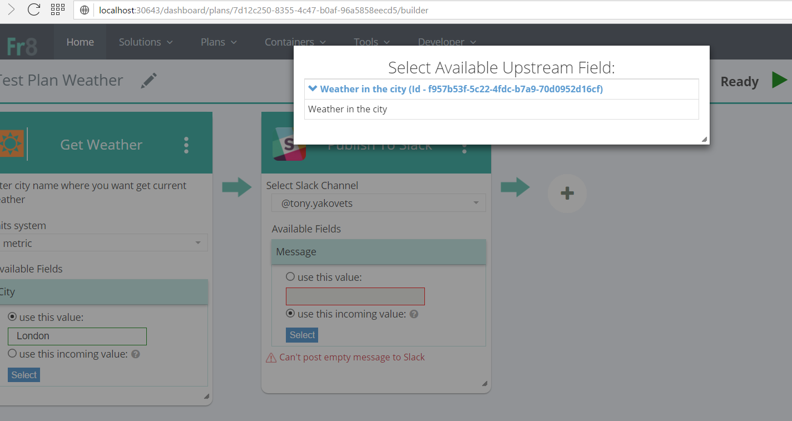

# .NET Step-by-step Terminal Builders Guide

[Terminal Developer's Guide Home](https://github.com/Fr8org/Fr8Core/blob/master/Docs/Home.md)

## Prerequisites

Before you start it would be good (but not neccessary) to read next topics:

*  [Fr8 Architecture](https://github.com/Fr8org/Fr8Core/blob/master/Docs/ForDevelopers/ArchitecturalModel.md)
*  [Fr8 Events](https://github.com/Fr8org/Fr8Core/blob/master/Docs/ForDevelopers/OperatingConcepts/Events.md)
*  [Fr8 Crates](/Docs/ForDevelopers/Objects/Crate.md)
*  [Fr8 Containers](https://github.com/Fr8org/Fr8Core/blob/master/Docs/ForDevelopers/Objects/Containers.md)
*  [Fr8 Activities](https://github.com/Fr8org/Fr8Core/blob/master/Docs/ForDevelopers/Objects/Activities.md)
*  [Fr8 Plans](https://github.com/Fr8org/Fr8Core/blob/master/Docs/ForDevelopers/Objects/Plans.md)
*  [Fr8 Authorization](https://github.com/Fr8org/Fr8Core/blob/master/Docs/ForDevelopers/Services/Authorization.md)

## Step 0 - Decide which service you want to wire up to Fr8

It would be nice to understand how 3rd-party service works and which pieces of business logic we want to use.
In this guide we will try to build two terminals, first will be easy and simple, second will be closer to real life complexity.  

### First: OpenWeatherMap.org  service whch will tell us (as it mentioned in it's name) weather
We should get ApiKey in order to use this service, register an account for this and obtain a key:

## Step 1 - Create terminal project 

We have two options here:
* using local hub for testing
* using one of public hubs, for example fr8.co

For our first terminal we will use local hub.

The easiest way to start is clone [Fr8 public repository](https://github.com/Fr8org/Fr8.NET "Fr8 public repository")  containing hub and common terminals.
After that we will have solution tree looks like this:

Now we can add project to **Terminals** folder. In order to do it we use VS project template.
Add *New Project* and type *fr8* in search box, you should see online template

 

Enter a name of the terminal you want to build (it could looks like terminal%ServiceName%), after that you got new project:

## Step 2 - Fill terminal information

Point your attention to **TerminalData.cs** file, here we have general information about our terminal:

    namespace terminalOpenWeatherMap
    {
        public static class TerminalData
        {
            public static WebServiceDTO WebServiceDTO = new WebServiceDTO
            {
                Name = "OpenWeatherMap",
                IconPath = "http://localhost:22587/OpenWeather.png"
            };

            public static TerminalDTO TerminalDTO = new TerminalDTO
            {
                Endpoint = CloudConfigurationManager.GetSetting("terminalOpenWeatherMap.TerminalEndpoint"),
                TerminalStatus = TerminalStatus.Active,
                Name = "terminalOpenWeatherMap",
                Label = "OpenWeatherMap",
                Version = "1"
            };
        }
    }

WebServiceDTO contains information about what you will see in hub's plan builder.  *Enpoint* value shows url of our terminal, and it recives value via fr8 infrastructure helper class from configuration file.  Look inside that **web.config** file.  

    <appSettings>
        <add key="CoreWebServerUrl" value="http://localhost:30643/" />
        <add key="HubApiVersion" value="v1" />
        <add key="terminalOpenWeatherMap.TerminalEndpoint" value="http://localhost:22587" />
        <add key="TerminalId" value="6a5c763f-4355-49c1-8b25-3e0423d7ecde" />
        
        <add key="ApiKey" value="%%%_some_api_key_value_%%%" />
        <add key="СityWeatherUrl" value="http://api.openweathermap.org/data/2.5/weather?q=%CITY%&amp;APPID=%APPKEY%&amp;units=%UNIT%" />
        
    </appSettings>

 *CoreWebServerUrl* is Hub url.  
 *TerminalId* is guid that will identify the terminal at Hub`s. 
 *terminalOpenWeatherMap.TerminalEndpoint* is Url of the terminal   
Last two values related to service we want to use.

Since our terminal don`t use authentification we can leave MVC Controllers as is. 

## Step 3 - Add first Activity 
In folder **Activities** we have single file, rename it and class inside to 'Get_Weather_v1', by convention activities named in snake_case notation with '_v%number%' at the end.
Inside we have definition of activity template, which Hub will store in database. 

     public class Get_Weather_v1 : TerminalActivity<Get_Weather_v1.ActivityUi>
     {
        public static ActivityTemplateDTO ActivityTemplateDTO = new ActivityTemplateDTO
        {
            Name = "Get_Weather",
            Label = "Get Weather",
            Category = ActivityCategory.Receivers,
            Version = "1",
            MinPaneWidth = 330,
            WebService = TerminalData.WebServiceDTO,
            Terminal = TerminalData.TerminalDTO
        };
        protected override ActivityTemplateDTO MyTemplate => ActivityTemplateDTO;
        private const string RunTimeCrateLabel = "Weather in the city";
        .....        
*Category* tells Hub what this activity does, in our case recives information.  
Next part of the class contains definition of user interface elements:

    public ActivityUi()
            {
                Annotation = new TextBlock
                {                   
                    Label = "Enter city name where you want get current weather",
                    Name = nameof(Annotation),
                    Source = new FieldSourceDTO
                    {
                        RequestUpstream = true
                    }
                };
                Units = new DropDownList
                {
                    Label = "Units system",
                    Name = nameof(Units),
                    Required = true,
                    ListItems = new List<ListItem>
                    { 
                        new ListItem() { Key = "metric", Selected = false, Value = "metric"},
                        new ListItem() { Key = "imperial", Selected = false, Value = "imperial"},
                        new ListItem() { Key = "Kelvin", Selected = true, Value = ""},
                    },
                    Value = "metric",
                    selectedKey = "metric"
                };
                City = new TextSource
                {
                    InitialLabel = "City",
                    Label = "City",
                    Name = nameof(City),
                    Source = new FieldSourceDTO
                    {
                        RequestUpstream = true
                    }
                };
                Controls = new List<ControlDefinitionDTO> { Annotation, Units, City };
            }
        }

*Controls* list contains elements described above and they will appear in activity configuration pane from top to bottom in same order as in this list. 
When we defined template and UI, activity is ready for actual work:

        public Get_Weather_v1(ICrateManager crateManager)
            : base(crateManager)
        {
        }

        public override Task Initialize()
        {
            var resultField = new FieldDTO(RunTimeCrateLabel, AvailabilityType.RunTime);
            CrateSignaller.MarkAvailableAtRuntime<StandardPayloadDataCM>(RunTimeCrateLabel, true).AddField(resultField);
            return Task.FromResult(0);
        }

Initialization step method invoked  when activity has been added to a plan. Here we anounce that our activity adds to Payload data with name stored in variable *RunTimeCrateLabel*. Next method is *Followup*, it will have invoked every time activity will configured.
We have not much to configure, so it is empty.

    public override Task FollowUp()
    {
        return Task.FromResult(0);
    }

    protected override Task Validate()
    {
        ValidationManager.ValidateTextSourceNotEmpty(ActivityUI.City, "You should enter city name");
        return Task.FromResult(0);
    }

Validation method calls every time with *Folloup*, unless *DisableValidationOnFollowup* variable setted up to *true* inside Activity constructor.
Now we are ready to do actual work, which happens when plan have been run.

    public override async Task Run()
    {     
        var restClient = new Fr8.Infrastructure.Communication.RestfulServiceClient();

        var url = CloudConfigurationManager.GetSetting("СityWeatherUrl");
        var apiKey = CloudConfigurationManager.GetSetting("ApiKey");

        var cityName = ActivityUI.City.GetValue(Payload);
        var unit = ActivityUI.Units.Value;
        url = url.Replace("%CITY%", cityName);
        url = url.Replace("%APPKEY%", apiKey);
        url = url.Replace("%UNIT%", unit);

        var weather = await restClient.GetAsync<JObject>(new Uri(url));
        var temp = weather.GetValue("main") as JObject;
        var result = $"Temperature in {cityName} is {temp.GetValue("temp")}";

        var payload = new StandardPayloadDataCM(new List<KeyValueDTO>() { new KeyValueDTO(RunTimeCrateLabel, result)});

        Payload.Add(RunTimeCrateLabel,payload);
    }
 You can do it in a any style you like. Here we use *RestfulServiceClient* from fr8 infrastructure. Everything is pretty straightforward. Last line of code adds to payload received from service data, which will be used in descendant activities. 

## Step 4 - Register Activity in terminal Startup class.
If you want make this Activity available for using in Hub, you should register it in Startup.cs 

    protected override void RegisterActivities()
    {
        ActivityStore.RegisterActivity<Activities.Get_Weather_v1>(Activities.Get_Weather_v1.ActivityTemplateDTO);
    } 

## Step 5 - Register your terminal in a hub.

Now we are ready to start. First, configure our terminal project and solution, be sure that terminal Url is the same as in **web.config**:

At the minimum we need **Hub**, *our terminal*, and **terminalSlack** being started. Set multiple startup projects in solution properties, and select this projects, then run the solution. 
After you register account and sign in, choose *Manage Terminals List* in *Developer* swction of navbar menu.

Here you can add Url of newly created terminal

## Step 6 - Build a plan 
After we registered new terminal we can see it inside plan builder. Let's create a new plan using our Activity.

Add Get_Weather Activity and Publish_to_Slack (from *Forwarders*) next to it. In Slack configuration we can select incoming value for Message. In upstream field we should see data which will be posted by our Activity.
 

## Step 7 - Run the plan
Try to enter name of well known city in *City* field of Get_Weather activity and then run the plan.
You will see mesasges in *Activity Stream* bar at right side of your screen, and finally message in Slack.
 

### Ok, if you feel yourself warmed up enough, do the second attempt. 
## Second terminal: Asana.com - helps you organize your todo list into projects.
If external service has SDK (and NuGet packages) it will be much easier to create Activities and handle authentication. But if not, you should do all work by yourself.
This terminal is little bit complicated, so most work will be done inside services using interfaces. You can mimic the codebase but always free to implement all the steps in way you like.

## Step 1 - Same as in first terminal, create new terminal project

## Step 2 - Fill terminal information
Here we will have one difference - *AuthenticationType* property is set to *External*. That means hub will handle authentication callbacks and going to interact with our terminal during that process.
 
    namespace terminalAsana
    {
        public static class TerminalData
        {
            public static WebServiceDTO WebServiceDTO = new WebServiceDTO
            {
                Name = "Asana",
                IconPath = "https://asana.com/favicon.ico"
            };

            public static TerminalDTO TerminalDTO = new TerminalDTO
            {
                Endpoint = CloudConfigurationManager.GetSetting("terminalAsana.TerminalEndpoint"),
                TerminalStatus = TerminalStatus.Active,
                AuthenticationType = AuthenticationType.External,
                Name = "terminalAsana",
                Label = "Asana",
                Version = "1"
            };
        }
    }

## Step 3 - Authentication handling

//// to be continued (structuring information...)

## Other Platform-Specific SDK
=====
*  Java
*  Ruby
*  Python
