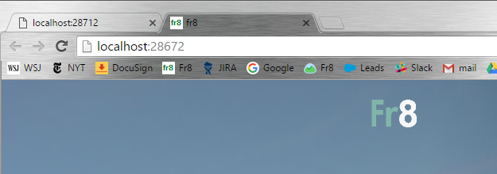

Building and Running Fr8
========================

1. Open the Fr8 solution in Visual Studio.

2. Decide which Terminals you want to run with and verify that your solution is set to open [Multiple Startup Projects](/Docs/ForDevelopers/DevelopmentGuides/Terminals/dotNet/MultipleStartupProjects.md)

3. Run Fr8. 

What you should see:

A web page should appear that has been produced by your HubWeb project. Curently this is on port 28672:

For each *terminal* that's running, an additional web page will appear:

(These pages serve no purpose except to signal that a Terminal is up and running.)

At this point, you should be able to register an account on your HubWeb project, and create Plans that use the Terminals you've started.

Troubleshooting
----------------

If you get build errors and want help, post to one of the [.Net support resources](/Docs/ForDevelopers/SDK/.NET/HelpResources.md).

####If you're getting Prebuild.bat errors....

These are generally related to Visual Studio being unable to find npm.exe. [More info](/Docs/ForDevelopers/DevelopmentGuides/Terminals/dotNet/TerminalDeveloping-GettingStarted.md).

####If you're getting javascript errors....
You may need to run "bower install" in your project root directory to get the javascript libraries loaded in. You can run this command in the Package Manager Console or from the Windows Command Prompt while in the project source directory.

