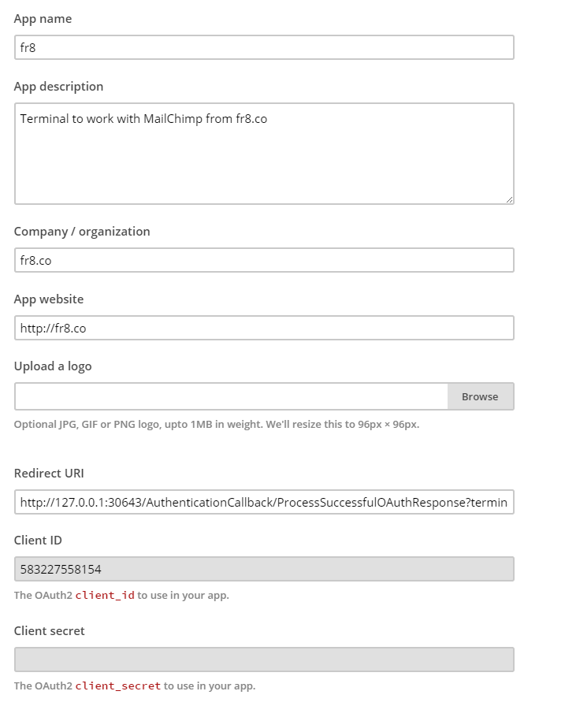
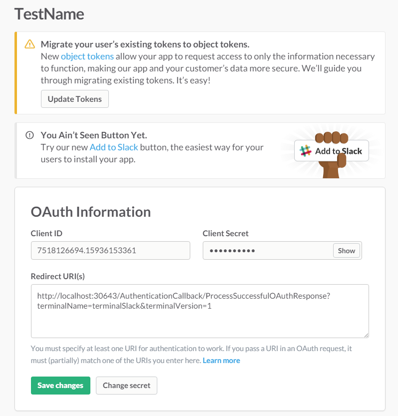

# Implementing oAuth2 authentication for a new Terminal

This material assumes you've got a good basic understanding of OAuth. If you need to learn, we recommend [this](https://aaronparecki.com/articles/2012/07/29/1/oauth2-simplified).

There are two elements of OAuth support you need to consider: 
1) The specific implementation supported by the Web Service your Terminal is connecting to
2) Participating in the Fr8 authorization interaction

We'll focus on #2. By looking at existing Terminal source code, you'll be able to see a number of different appraoches to #1.

The Basic Fr8 Authorization Interaction
--------------------------------------

1. Fr8 checks that Activity needs authentication and doesn't have a token; asks Terminal for **initialOAuthUrl**
2. Terminal passes **initialOAuthUrl** to Fr8.
3. Fr8 redirects user to this **initialOAuthUrl** via authentication window and receives a response from a 3rd party service
4. Fr8 passes response to Terminal. 
5. Terminal gets **code** from a response and uses OAuthAccessUrl to exchange it for an oAuth2 **access_token**. Terminal passes retrieved access_token to Fr8
6. Fr8 stores the **access_token**

As a Terminal developer you have to implement steps 2 and 5

###Preparation for initial oAuth url

First you have to find oAuth2 documentation of the service you are working with.
After that you have to register Fr8 as an app. Specify **redirect_uri**, retrieve **client_id** and **client_secret**

| Mail Chimp app registration   |      Slack app registration      |
|----------|:-------------:|
| |   | 

After that you should be able to compose an **initialOAuthUrl**

It might look like this: 
`https://slack.com/oauth/authorize?client_id=9815816992.14932358039&amp;state=%STATE%&amp;scope=client&amp;redirect_uri=http://localhost:30643/AuthenticationCallback/ProcessSuccessfulOAuthResponse?terminalName=terminalSlack%26terminalVersion=1`
or this: 
`https://login.mailchimp.com/oauth2/authorize?response_type=code&amp;state=%STATE%&amp;client_id=583227558154&amp;redirect_uri=http%3A%2F%2F127.0.0.1%3A30643%2FAuthenticationCallback%2FProcessSuccessfulOAuthResponse%3FterminalName%3DterminalMailChimp%26terminalVersion%3D1`

**redirect_uri** is where the user will be redirected after authentication. Currently we use URL's like `http://localhost:30643/AuthenticationCallback/ProcessSuccessfulOAuthResponse?terminalName=terminalName&terminalVersion=1`

**Note 1**: In order to use "&" in .conifg file you have to replace it with "&amp;"
**Note 2**: Make sure, that  redirect_uri is HTTP encoded

Encoded: ` http://localhost:30643/AuthenticationCallback/ProcessSuccessfulOAuthResponse?terminalName=terminalSlack%26terminalVersion=1 `
Not encoded: ` http://localhost:30643/AuthenticationCallback/ProcessSuccessfulOAuthResponse?terminalName=terminalSlack&terminalVersion=1 `
###Configuring initial oAuth url
To pass **initialOAuthUrl** to Fr8 your Terminal has to have AuthenticationController
Following code in AuthenticationController passes initialOAuthUrl to Fr8

CloudConfigurationManager.GetSetting("MailChimpOAuthUrl") retrieves a value specified in Web.config:
`<add key="MailChimpOAuthUrl" value="https://login.mailchimp.com/oauth2/authorize?response_type=code&amp;state=%STATE%&amp;client_id=583227558154&amp;redirect_uri=http%3A%2F%2F127.0.0.1%3A30643%2FAuthenticationCallback%2FProcessSuccessfulOAuthResponse%3FterminalName%3DterminalMailChimp%26terminalVersion%3D1" />`

If you have composed  **initialOAuthUrl** right, then user will be redirected to 3rd party authentication page and after user enters his credentials **redirect_uri** will be called with code and state parameters
After that in AuthenticationController you have to implement a method to **GenerateOAuthToken** and return it to Fr8 

###Configuring **OAuthAccessUrl**

As with **initialOAuthUrl** you have to compose **OAuthAccessUrl** based on service documentation.
You certainly will have to specify **code, client_id, client_secret** and **redirect_uri**
MailChimp service requiere to specify **response_type=code**. Slack doesn't 

###Generating oAuthToken

When user have entered credentials Fr8 passes response to Terminal / AuthenticationController / token
In order to generate **oAuthToken** you have to make a call to OAuthAccessUrl with the code you've received
First you have to parse received **code** and **state**

When you get **code** and **state** you have to make a call to **OAuthAccessUrl**
Different services might have different requirements on how this call should be perfomed! 
Pay attention to documentation!

For example in Slack, in order to exchange code for token you simply have to make a GET call on the **OAuthAccessUrl** with code specifed.

In ChimpMonkey you have to do it differently.
You have to:
1. Make a POST call to https://login.mailchimp.com/oauth2/token
2. Specify response_type in addition to **code, client_id,  client_secret and  redirect_uri** as a POST call payload
3. Specify special User-Agent 
4. Decompress the response

Code for ChimpMonkeys GetOAuthToken looks like this:

If you've done everything right - you will get the oAuth token 

###Troubleshooting:
- Pay attention to API documentation
- Make sure your redirect URL is HTTP encoded
- Make sure your redirect URL is equivalent everywhere
- Use Fiddler to check if your request exactly matches the one specified in documentation

###WebService
After you are done with Authentication you have to configure the [WebService](TerminalDeveloping-AddingAWebService.md) 

